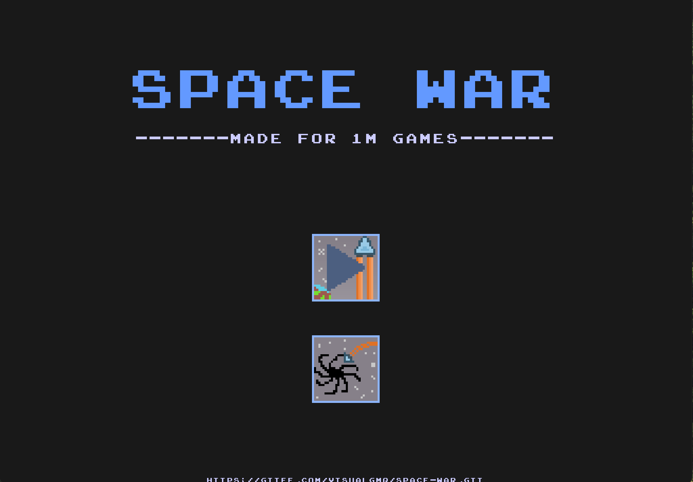
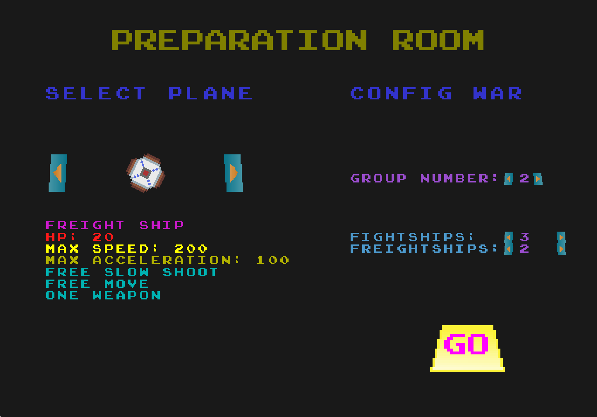
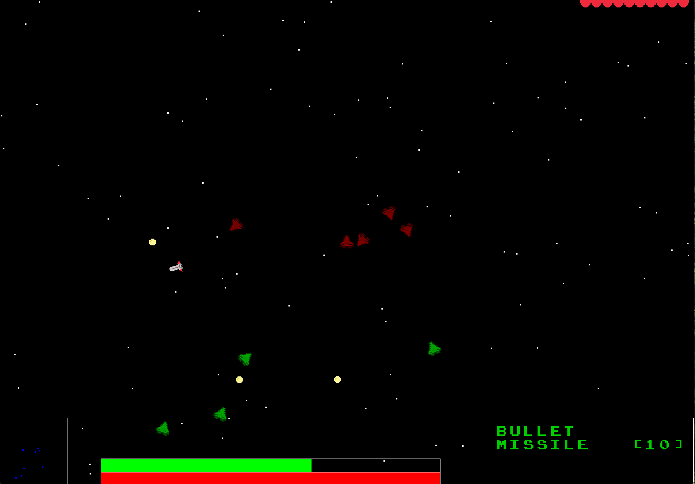

# SpaceSector

为1MGames游戏开发大赛制作的游戏。

## 编译方法

使用CMake 3.20及以上进行编译。目前只能在Mac平台下编译（因为我用的glad是Mac专属，你也可以将你平台的glad替换`libs/glad`文件夹来编译，glad指定OpenGL3.3 Core版本）

```bash
cmake -S . -B build -DCMAKE_BUILD_TYPE=Release
cmake --build build
```

如果想要压缩文件至1M以下，你需要有`strip`程序和`upx`程序，并执行：

```bash
cmake --build build --target CompressExe
```

编译好后执行pack程序打包：

```bash
pack.sh
```

最终的结果在`output`文件夹下。

## 游戏截图







## 游戏操作

[游戏操作](./HowToPlay.md)
