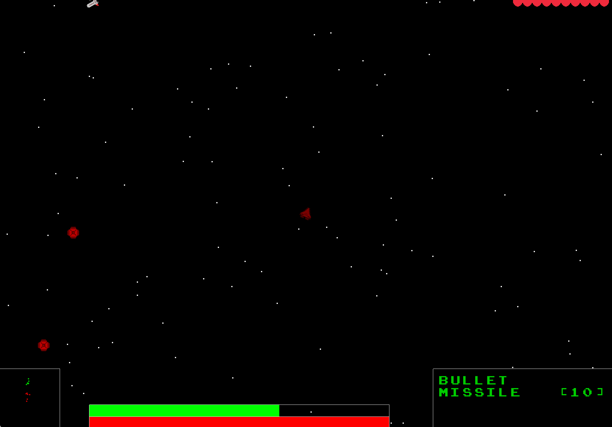

# SpaceWar

一款空战类游戏。采用C++17开发。  

## 1MGames相关

1MGames比赛相关代码在`1mgames`分支下。此分支在未来可能会继续开发，目前不稳定。

## 编译方法

依赖:

* SDL, SDL\_image, SDL\_ttf

使用CMake 3.20及以上进行编译。需要拉取`SDLEngine`作为子工程：

```bash
git submodule update --init --recursive
```

然后编译：

```bash
cmake -S . -B build -DCMAKE_BUILD_TYPE=Release
cmake --build build
```

编译好后执行pack命令打包

```bash
cmake --build build --target Pack
```

最终的结果在`output`文件夹下：

* game：包含了游戏本体
* snapshot：包含了游戏的截图
* HowToPlay.md：游戏说明

## 游戏截图





## 游戏操作

[游戏操作](./HowToPlay.md)
